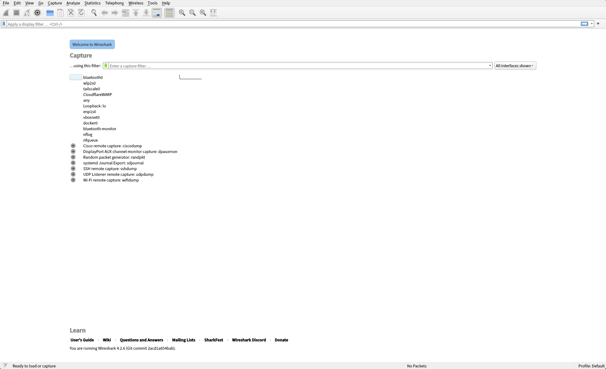

# Chapter 5 - Wireshark で通信を覗いてみよう

この章では、Wireshark を使用して UDP 通信を観察してみます。Wireshark は、ネットワークパケットをキャプチャし、詳細な情報を表示するツールです。ネットワークのトラブルシューティングやセキュリティ解析などに使用されます。

## Wireshark のインストール

Wireshark は、以下のコマンドでインストールできます。

```bash
sudo apt install wireshark
```

インストールが完了したら、Wireshark を起動します。

```bash
wireshark
```

起動すると、以下のような画面が表示されます。



ここでは、無線LANのインターフェース(`wlp2s0`)を選択してキャプチャを開始します。

少し古いOSの場合、無線LANインターフェース名が `wlan0` などの場合があります。インターフェース名は、以下のコマンドで確認できます。

無線LANインターフェースが表示されない場合、権限が不足している可能性があります。以下のコマンドでユーザーを `wireshark` グループに追加してください。

```bash
sudo usermod -aG wireshark $USER
```


